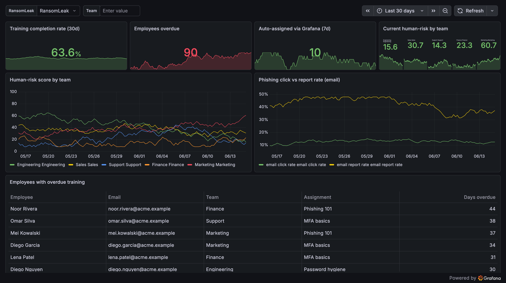

# RansomLeak data source for Grafana

[](https://www.gnu.org/licenses/agpl-3.0)

Open-source Grafana **data source** that queries the [RansomLeak](https://ransomleak.com)
API live, so security-awareness training, per-team human-risk score, and
phishing/smishing outcomes can be charted next to the rest of your operational
telemetry. Human-risk observability for any Grafana user running RansomLeak — not
a one-off export.

> Looking for the user-facing overview shown on the Grafana catalog page? See
> [`src/README.md`](./src/README.md).



## How it works

Grafana is a visualization layer, not a data store, so the plugin **pulls**:
the customer installs this data source and Grafana queries the RansomLeak API on
demand. There is no emitter, no backend component, and no Go code in v1.

```
Grafana (customer)                          RansomLeak API
  RansomLeak data source (this repo)
    jsonData.host + secureJsonData.apiKey
    query editor: metric + team + channel + format
        │
        │  Grafana data proxy (server-side; injects Authorization
        │  from secureJsonData via the `rl` route in plugin.json)
        ▼
  POST {host}/api/integration/grafana/query  ──►  IntegrationGrafanaController
        returns SimpleJSON time-series / table        (@PartnerIntegrationAuth)
```

The partner API key lives only in Grafana's encrypted `secureJsonData` and is
templated into an `Authorization: Bearer …` header by the data proxy route. It
never reaches the browser and there is no CORS surface.

### Backend contract

All endpoints are under `/api/integration/grafana` and authenticated with the
partner key:

| Endpoint        | Used by             | Returns                                                        |
| --------------- | ------------------- | ------------------------------------------------------------- |
| `GET  /health`  | `testDatasource()`  | `200` when the key is valid                                   |
| `POST /search`  | `metricFindQuery()` | the selectable metric names                                  |
| `POST /query`   | `query()`           | SimpleJSON time-series `[{target,datapoints}]` or `[{type:"table",columns,rows}]` |

`POST /query` body: `{ metric, team?, channel?, format: "time_series" | "table", range: { from, to }, intervalMs, maxDataPoints }`.

Metrics: `human_risk_score`, `training_completion_rate`, `assignments_overdue`,
`phishing_click_rate`, `phishing_report_rate`, `overdue_users`,
`assignments_by_category`, `auto_assigned_via_grafana`.

## Project layout

```
src/
  datasource.ts            query()/testDatasource()/metricFindQuery() + SimpleJSON→DataFrame mapping
  components/ConfigEditor   host (jsonData) + partner key (secureJsonData)
  components/QueryEditor     metric dropdown + team + channel + format
  metrics.ts               metric catalog / dropdown fallback
  types.ts                 query + options + SimpleJSON response types
  plugin.json              datasource manifest incl. the `rl` data-proxy route
  dashboards/              bundled "RansomLeak Human Risk" dashboard
dev/
  mock-ransomleak/         zero-dependency dev stand-in for the RansomLeak API (see its README)
provisioning/              dev-only Grafana provisioning (datasource + dashboard) → the mock
```

## Develop

```bash
npm install
npm run dev          # build + watch the frontend
npm run mock         # start the dev mock RansomLeak API on :4000 (separate terminal)
npm run server       # start Grafana in Docker with the plugin + provisioning mounted
```

Then open http://localhost:3000 (admin/admin). The provisioning points a
**RansomLeak** data source at the mock, so **Save & test** is green and the
bundled dashboard renders immediately. See
[`dev/mock-ransomleak/README.md`](./dev/mock-ransomleak/README.md) for the mock
and how to point at a real dev host instead.

### Quality gates

```bash
npm run typecheck
npm run test:ci      # Jest unit tests for the SimpleJSON→DataFrame mapping
npm run lint
npm run build
npm run e2e          # Playwright (needs `npm run server` running)
```

## Publish to the Grafana catalog

The plugin is frontend-only and catalog-ready (passes `@grafana/plugin-validator`).
Signing requires a real Grafana Cloud API key and submission publishes under your
org — see [`SUBMISSION.md`](./SUBMISSION.md) for the exact, sign-ready steps.

## License

[GNU Affero General Public License v3.0](./LICENSE) (AGPL-3.0-only).
